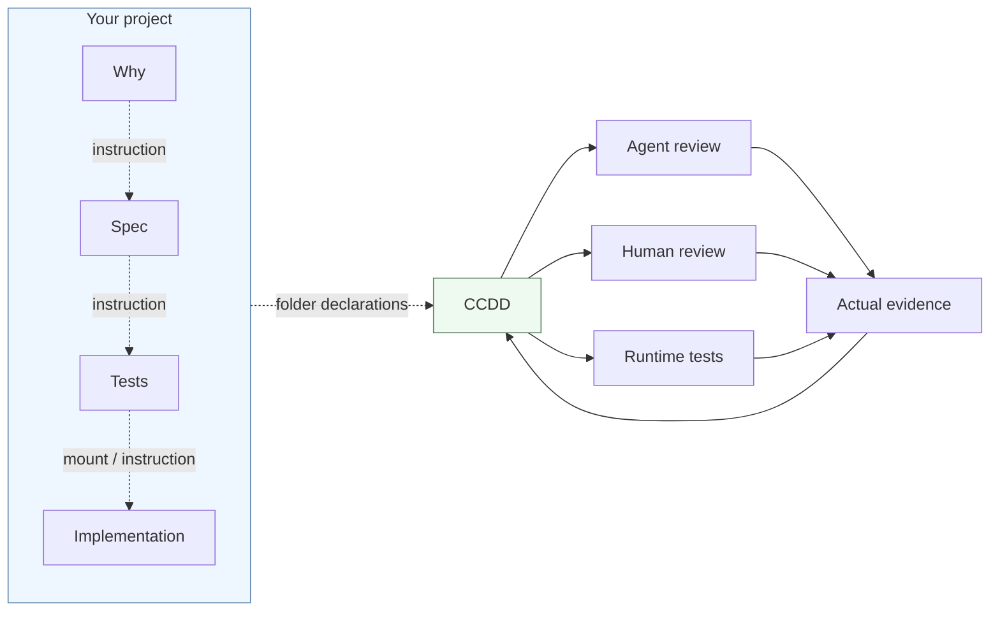

# CCDD

**Let verification define the project.** Give each Artifact its own criteria and the tools a reviewer needs to inspect it. An Artifact can be code, tests, a specification, an image or any other folder of project material.

Put a `ccdd.json` in that folder. It owns the Artifact's name, view tools and Critics. CCDD finds those declarations, connects references and collects actual review evidence.

```text
project/
  why/ccdd.json
  spec/ccdd.json
  tests/ccdd.json
  implementation/ccdd.json
```

A Critic can ask an Agent to compare Spec with Why, ask a person to compare two images, or run tests against an implementation. It belongs to the Artifact it evaluates. References such as `{spec}` connect it to the other Artifacts it uses.



These relationships define required input and verification, not execution order. Mutual dependencies are allowed: both Critics may run together, and final validation requires both matching results. Child Artifact folders are automatic dependencies. Logical `mounts` connect other folders without copies or symlinks.

## Start with a runtime check

Use Node.js 22 LTS, version 22.19.0 or later.

```sh
npm install --ignore-scripts @ccdd/core@^4 @ccdd/project@^4
```

Inside an Artifact folder, create `ccdd.json`:

```json
{
  "name": "implementation",
  "critics": [{
    "id": "tests",
    "title": "Pass the implementation tests",
    "profile": { "kind": "runtime", "command": "node", "args": ["--test", "check.test.mjs"] },
    "payload": { "instruction": "Run the tests for {implementation}." }
  }]
}
```

Add your actual `check.test.mjs`, then run from the workspace root:

```sh
npx ccdd-project config check
npx ccdd-project plan implementation --recursive
npx ccdd-project verify implementation --recursive --wait
npx ccdd-project status implementation
```

The [getting-started guide](docs/getting-started.md) includes a complete runnable example. Version 4 is a breaking change; existing projects should follow the [migration guide](docs/migration-v4.md).

## Read the result

Every actual review returns a verdict, summary and concrete evidence. GREEN means its criteria were met; RED means they were not. Execution problems produce ERROR. Final validation needs matching PASS evidence for all required Critics and dependencies. A folder without Critics stays UNREVIEWED unless explicitly declared `basis: true`.

An individual check runs its selected Critics immediately. If other required evidence is missing, their results are saved and the request is INCOMPLETE. Add `--recursive` to include those other evaluations. CCDD reuses matching actual evidence and computes freshness when queried; it does not store stale flags.

Reviews run in the workspace you supply. Keep it unchanged until completion, including Human waiting. Records, caches and generated output live outside it. To keep editing elsewhere, create your own worktree and pass it with `--repo`.

## Next steps

- [Define a custom view script](examples/custom-text-reader/README.md) with JSON stdin/stdout, using any language.
- [Register optional text, image and desktop tools](packages/default-tools/README.md).
- [Compose folders and mounts](examples/artifact-folders/README.md), including coding-style and blind image comparison Critics.
- [Compute views on demand](examples/computed-views/README.md) from scenario material.
- [Configure Agent and Human reviewers](docs/reviewers.md).
- [Try Why → Spec → Tests → Implementation](docs/demo.md).
- [Look up commands and evidence rules](docs/project-validation.md).

The optional local monitor shows folders, relationships, cycles, review progress and saved results. Start it with `npx ccdd-project monitor`.

| Package | Responsibility |
| --- | --- |
| `@ccdd/core` | Public definitions and logical path resolution. |
| `@ccdd/project` | Validation, CLI, Broker, Executors and monitor. |
| `@ccdd/default-tools` | Optional common view scripts; no automatic registration. |

See [Contributing](CONTRIBUTING.md), [the context map](CONTEXT-MAP.md), [detailed contracts](docs/contracts.md) and [release instructions](docs/releases.md). Repository content and review prompts use English.

## License

[MIT](LICENSE).

Unreleased development: requester results default to a compact projection in the upcoming **5.0 breaking release**. See [migration and audit lookup](docs/project-validation.md#compact-review-results-unreleased-50) and [unreleased notes](docs/releases/unreleased.md).
