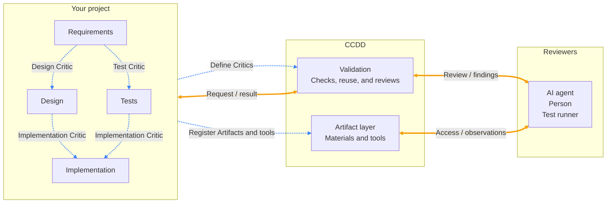

# CCDD

**Check that the pieces of your project fit together.**

A project has requirements, designs, tests, and implementations. CCDD connects these pieces to the checks that review them. An AI agent can compare a design with its requirements, a person can inspect an image, and a test runner can check an implementation.

You choose the materials, the review criteria, and the tools reviewers can use. CCDD keeps track of what was reviewed and which checks are still needed.

## How it fits together

**Blue dashed lines: configuration. Orange solid lines: requests and reviews.**



Three terms explain the picture:

| Term | Meaning | Example |
| --- | --- | --- |
| **Artifact** | A named file, folder, or group of materials to review. | `spec.md`, `tests/`, or an image. |
| **Critic** | A check with one target, reference materials, and a reviewer. | “Does this design meet these requirements?” |
| **Artifact tool** | A way for a reviewer to inspect an Artifact. | Read text, view an image, or open a desktop application. |

Each Critic declares its target and references. These relationships form a directed acyclic graph, or **DAG**: checks can branch and join, but cannot depend on themselves through a cycle. The two Implementation arrows above belong to one Critic that references both Design and Tests. Requirements are an explicitly accepted starting point in this example.

## What you do

1. **Name your materials.** Give each Artifact an ID, a type, and a file or folder path. Groups collect existing Artifacts.
2. **Connect tools.** Use the optional default tools or write your own `metadata` and `execute` function. Register them by Artifact type in `ccdd.config.ts`.
3. **Define checks.** For each Critic, choose the target, its references, the review criteria, and an Agent, Human, or Runtime reviewer.
4. **Request a review.** Read the findings, update your project, and request another check when needed.

For example, a document tool registered as `read` becomes `read_spec` when connected to the `spec` Artifact. CCDD gives the Agent its name, description, and input schema. When the Agent calls it, CCDD invokes your local `execute` function against the fixed review input and returns the content to the Agent.

Artifact types act as plugin slots through explicit registration. Importing a tool library does not register or run its tools. Agent and Human tools are registered separately; Runtime reviewers execute configured Node tests against the declared inputs.

## Try your first review

CCDD supports **Node.js 22 LTS (22.19.0 or later)**. Use the latest patch of a supported LTS release.

For published packages, install:

```sh
npm install --ignore-scripts @ccdd/core @ccdd/project
```

Follow [Your first review](docs/getting-started.md) for a complete, small example that runs a real test without an AI account. It also covers installation from local packages when a version has not been published.

Once your project has a configuration, the usual loop is:

```sh
npx ccdd-project status
npx ccdd-project plan implementation --recursive
npx ccdd-project verify implementation --recursive --wait
npx ccdd-project history implementation
```

`status` and `plan` explain what is needed without starting reviews. `verify --recursive` includes any required earlier checks. To review only the selected scope, omit `--recursive`; blocked checks are reported as incomplete.

## What you get back

A completed review contains a **verdict, a summary, and concrete evidence**. GREEN means that Critic's criteria were met; RED means they were not. An execution problem is reported as ERROR. All required Critics must pass before their Artifact satisfies a dependent check.

CCDD can reuse an actual passing review when its criteria, target, and direct reference materials still match and its dependencies are satisfied. An unchanged intermediate Artifact can therefore prevent unnecessary downstream reviews.

Reviews use a fixed copy of the project by default. Records and generated output live outside the reviewed project. You can keep editing the original while a copied review runs. Reviewers inspect and judge; you or your coding tools make the changes.

## Choose your next step

- [Write an Artifact tool](examples/custom-text-reader/README.md) using the public tool contract.
- [Use default text, file, image, and desktop tools](packages/default-tools/README.md).
- [Review a group of materials](examples/artifact-groups/README.md), such as an effect description and its preview image.
- [Use Agent and Human reviewers](docs/reviewers.md), including credentials and result submission.
- [Explore the demo](docs/demo.md): Why → Spec → Tests → Implementation.
- [Look up commands, reuse rules, and exit codes](docs/project-validation.md).

An optional local monitor shows current-input checks and saved reviews. Start it with `npx ccdd-project monitor`.

## Packages and development

| Package | Purpose |
| --- | --- |
| `@ccdd/core` | Define Artifacts, Critics, and tools. |
| `@ccdd/project` | Run the CLI, manage reviews, and view their history. |
| `@ccdd/default-tools` | Optional ready-made Artifact tools. |

The repository, examples, CLI, monitor, and built-in review instructions use English. See [Contributing](CONTRIBUTING.md) for setup and checks, [the context map](CONTEXT-MAP.md) for architecture, and [release instructions](docs/releases.md) for packaging and publication.

## License

Licensed under the [MIT License](LICENSE).
