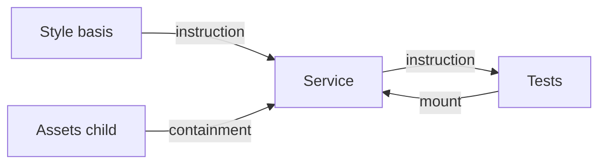

# Artifact relationships

A folder with `ccdd.json` is one Artifact. It owns its views and its local Critics. Its name is globally unique; a Critic's full ID is `artifact/critic`.

Relations are derived from nearest marked descendants, mounts and Critic instruction references. They describe required material and verification, without requiring a topological execution order.



`Service` and `Tests` can evaluate each other concurrently. Their final scope requires both actual matching PASS results. Strongly connected component hashing makes identities finite; visited-set traversal makes scope discovery terminate. A cycle itself supplies no evidence.

```json
{
  "name": "service",
  "mounts": { "style": "coding-style", "suite": "tests" },
  "critics": [{
    "id": "coding-style",
    "title": "Follow the coding conventions",
    "profile": { "kind": "agent", "provider": "openai-codex", "model": "gpt-6-astra", "reasoning": "medium" },
    "payload": { "instruction": "Read {service} and {style}. Check whether implementation follows the declared coding conventions and project boundaries." }
  }]
}
```

Add the actual Agent views to both referenced folders before executing this illustrative declaration. The [complete folder example](../examples/artifact-folders/README.md) also compares anonymous images through an ordinary script view.

A parent may inspect its child or mounted material, but does not inherit their views or Critics. Multiple mount aliases resolve to one canonical Artifact. Other global names may be referenced explicitly in instructions. Missing names and ambiguous aliases fail configuration validation. No symlinks or folders are created by resolving a mount.

The monitor shows physical folder locations, owned Critics and typed cyclic edges. Queued execution and incomplete final evidence have different meanings. See [Project Validation](project-validation.md).
